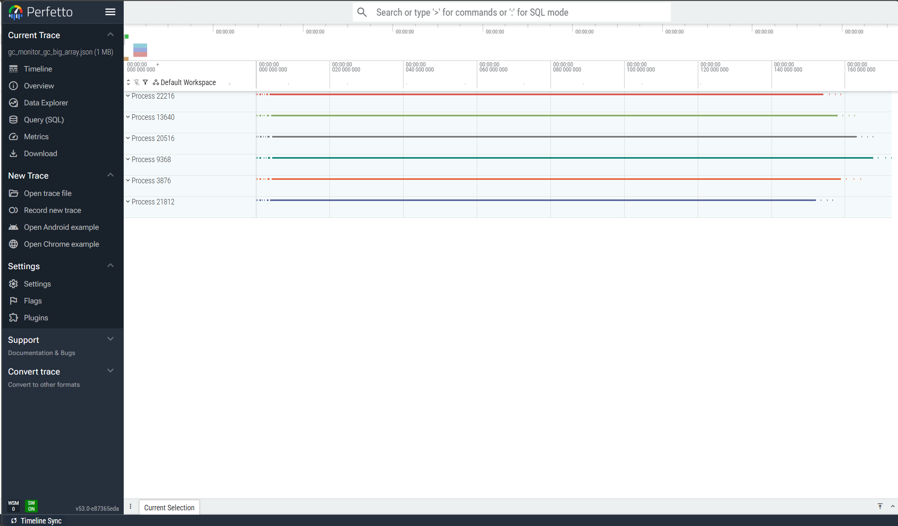

# gcmon - zero-overhead GC monitoring for Python

[](https://pypi.org/project/gcmon/)
[](https://github.com/sergey-miryanov/gcmon/actions/workflows/ci.yml)
[](https://pypi.org/project/gcmon/)
[](https://codecov.io/gh/sergey-miryanov/gcmon)
[](https://app.codspeed.io/sergey-miryanov/gcmon?utm_source=badge)
[](https://pepy.tech/projects/gcmon)
[](https://deepwiki.com/sergey-miryanov/gcmon)
[](LICENSE)

gcmon watches a running Python process's garbage collector from **outside**
the process — no code changes, no callbacks, no in-process overhead. Export to
Chrome Trace, Perfetto, or JSONL; query with PerfettoSQL.

> **Requires CPython 3.15+** for the monitored process and the `gcmon`
> process, built from the same source. See [Limitations](#limitations) for
> details.

## Why gcmon?

Python's garbage collector can introduce unpredictable pauses in
applications. The standard library provides `gc.get_stats()` for
aggregate collection counters and `gc.callbacks` for per-event hooks,
but both run inside the target process: callbacks add execution
overhead that distorts timing, while `gc.get_stats()` only exposes
cumulative counters with no per-pause resolution. Neither can monitor
a process without modifying its code.

Most monitoring tools report the **GC collection count**, how often the collector ran.
What hurts a latency-sensitive service is **GC pause time**, how long each
collection held it up, and reporting that requires a source inside CPython's
own GC bookkeeping. See [Alternatives Comparison](#alternatives-comparison) for
what each tool reports.

gcmon reads GC statistics directly from a target process's memory using
platform-specific memory access APIs. The target process is never
paused (GC statistics are written to a ring buffer and read as a whole),
so there is zero in-process overhead and no code changes required.

Use it to profile GC pause times, compare live-object count and RSS trends, or
integrate GC metrics into benchmarks.

## Features

- **Real-time GC monitoring** - Track garbage collection events in running Python processes
  without in-process overhead
- **Multiple export formats** - Chrome Trace Event, Perfetto binary protobuf, JSONL file, and JSONL to stdout ([examples](#example-chrome-trace-output))
- **CLI** - Monitor processes or run scripts with GC monitoring ([usage](#cli-usage))
- **RSS tracking** - Track Resident Set Size of monitored processes in Chrome and Perfetto traces ([details](#rss-tracking))
- **Pyperf hook integration** - Seamlessly integrate with pyperf benchmarks ([pyperf hook](#pyperf-hook-integration))

## When to Use

**Use gcmon when you want to:**

- Profile GC pause times in production or staging without modifying application code
- Measure GC impact on latency-sensitive services (APIs, real-time systems)
- Correlate GC activity with benchmark results via the pyperf hook
- Track live object count trends over time across running processes
- Debug intermittent latency spikes suspected to be GC-related

**Use something else when you need to:**

- Find which code paths trigger collections — use [`profiling.sampling`](https://docs.python.org/3.15/library/profiling.sampling.html), or [`austin`](https://github.com/P403n1x87/austin) with `-g` on interpreters older than 3.15 (statistical, no per-pause timing or heap data)
- In-process GC callbacks (e.g., triggering actions on collection) — use [`gc.callbacks`](https://docs.python.org/3/library/gc.html#gc.callbacks)
- Cumulative collection counters without per-pause detail — use [`gc.get_stats()`](https://docs.python.org/3/library/gc.html#gc.get_stats)
- Monitor across different Python builds — gcmon requires the exact same binary (see [Limitations](#limitations))

## Alternatives Comparison

| Tool | GC Pause Time | Code Changes | Overhead | Best Use Case |
|---|---|---|---|---|
| gcmon¹ | Yes — exact | None | Zero in-process | Production GC monitoring |
| [`profiling.sampling`](https://docs.python.org/3.15/library/profiling.sampling.html)², [`austin`](https://github.com/P403n1x87/austin) | Partial³ | None | Near-zero in-process | Which code triggers GC |
| `gc.callbacks` | Yes — exact | High (custom code) | Moderate (Python call) | Custom metrics pipelines |
| `gc.get_stats()` | No — cumulative only | Minimal | Minimal | Basic counters |
| APM agents (Datadog, New Relic, Dynatrace) | Varies⁴ | Agent required | Moderate | Distributed tracing |
| [OpenTelemetry runtime metrics](https://opentelemetry-python-contrib.readthedocs.io/en/latest/instrumentation/system_metrics/system_metrics.html) | No — counts only⁵ | Wrapper or SDK | Low | Fleet-wide GC counters |

¹ Requires CPython 3.15+ on both sides, built from the same source. See
[Limitations](#limitations).

² Stdlib from CPython 3.15 on; austin covers older interpreters.

³ Both mark the samples taken during a collection (`<GC>` frames, austin's
`-g`), which gives GC as a share of samples and the stacks behind it, but no
per-pause durations and no heap data.

⁴ Datadog and New Relic ship theirs off by default: Datadog reports
per-generation collection counts, New Relic per-generation pause time via
`gc.callbacks`. Dynatrace collects GC activity per generation.

⁵ Reports collection counts (`cpython.gc.collections` and friends), not durations.
Platforms that bundle OTel, Odigos among them, forward the same counters.
eBPF sensors such as Groundcover's watch kernel events, not CPython's GC phases.

> Exact GC pause time has only two sources: `gc.callbacks` inside the process,
> whether your own or an agent's, and `_remote_debugging.get_gc_stats()` reading
> CPython's ring buffer from outside it. Everything else samples or counts.
> gcmon builds on the latter.

### Decision Guide

**GC pauses** — *My service stalls and I suspect the collector.*
→ Run **gcmon** against the PID for exact per-pause timings.

**GC origin** — *I know collections are costly, but not what triggers them.*
→ Sample the process with [`profiling.sampling`](https://docs.python.org/3.15/library/profiling.sampling.html) and read its `<GC>` frames.

## How It Works

gcmon runs **outside** the target process. It reads GC statistics directly
from the process's memory using platform-specific memory access APIs
(available in CPython 3.15+).

For the pyperf hook integration, gcmon uses an **external process model**:

1. The hook spawns the `gcmon` CLI as a separate process
2. The external process reads the target process memory directly
3. Results are written to a temporary JSON file
4. The hook reads the JSON and injects metrics into pyperf metadata

This provides zero in-process overhead during benchmarks, crash isolation
(gcmon crashes don't affect the target), and clean separation of concerns.

## Limitations

### Same Python version and build

The monitoring and monitored processes must use the **exact same Python version
and build**. `gcmon` reads GC statistics directly from the target process's
in-memory data structures, and the layout of these structures varies between
Python versions and build configurations (fields, offsets, sizes). Mismatched
binaries are rejected by the Python runtime to prevent undefined behavior or
crashes.

In practice, run both processes from the same virtualenv, container image, or
`pyenv`/`uv` environment so they share a single Python binary.

### No call-stack attribution

gcmon reports when each collection ran, how long it took, and how large the heap
was, plus a per-phase breakdown on a custom CPython build with enhanced GC
instrumentation (see the [build note](#example-chrome-trace-output)). It cannot
tell you which code triggered the collection, because the GC records carry no
stack information. A sampler answers that question, so the two pair well: see
[Alternatives Comparison](#alternatives-comparison).

### No OS-level memory pressure

gcmon reports the collector's view of the heap, plus RSS samples when `--rss` is
enabled. Neither is a measure of OS-level memory pressure. Use `psutil`,
Prometheus node exporters, or eBPF tooling for that.

## Requirements

- **Python**: CPython 3.15 or newer is required for both the monitoring and
  the monitored process.
- **Operating systems**: Linux, macOS, and Windows are supported (the test
  matrix runs on `ubuntu-latest`, `macos-latest`, and `windows-latest`).
- **Process access**: gcmon reads another process's memory using
  platform-specific APIs. On Linux and Windows no extra setup is
  needed. On **macOS**, the calling process must be authorized to read the
  target process memory.

## Installation

```bash
pip install gcmon

# With optional extras
pip install gcmon[stats]      # High-accuracy statistics (see Statistics below)
pip install gcmon[cmdline]    # Process command line in Perfetto traces
pip install gcmon[stats,cmdline]  # Both extras
```

### `[stats]` — High-Accuracy Statistics

Install [DDSketch](https://github.com/DataDog/sketches-py) for memory-efficient, high-accuracy percentile tracking:

```bash
pip install gcmon[stats]
```

Without this extra, statistics use a fixed 1024-sample buffer. With it, all samples are tracked with 0.1% relative accuracy. See [Statistics](#statistics) for details.

### `[cmdline]` — Process Command Line & RSS Tracking

Install [psutil](https://github.com/giampaolo/psutil) to populate the `cmdline` field in Perfetto traces and enable RSS tracking:

```bash
pip install gcmon[cmdline]
```

When this extra is installed:
- The Perfetto exporter reads the command line of each monitored process and includes it in the trace. This appears as a tooltip in the Perfetto UI.
- RSS tracking (`--rss`) can sample Resident Set Size via `psutil.Process(pid).memory_info().rss`.

Without this extra, the `cmdline` field is omitted and `--rss` is silently ignored (an info log is emitted at startup). All other trace data is unaffected.

## Quick Start

```bash
# Monitor a running process by PID (default Chrome Trace format)
gcmon 12345

# Run a Python script with GC monitoring
gcmon run -s my_script.py

# Monitor with custom output and statistics output
gcmon 12345 -o trace.json --stats

# Perfetto binary output with RSS tracking
gcmon 12345 --format perfetto -o trace.pftrace --rss

# Combine multiple traces (e.g. different runs or builds) into a single file
gcmon combine trace1.json trace2.json -o combined.json -n
```

### What you'll see

By default gcmon stays quiet — the trace is written to a file and gcmon
exits when the target ends or you press `Ctrl+C`. Use `-v` to follow
progress:

```bash
$ gcmon 12345 -v
[INFO] monitoring PID 12345 (chrome trace → gcmon.json)
[INFO] collected 42 GC events so far
...
[INFO] stopping (Ctrl+C)
[INFO] wrote 42 events to gcmon.json
```

Open the output file in [Perfetto UI](https://ui.perfetto.dev) — the
built-in SQL panel lets you query the trace directly; see the examples
below.

### Example: Chrome Trace Output


*Example: GC monitoring data visualized in Perfetto UI showing:*
- *Process tracks with command line tooltips (requires `[cmdline]` extra)*
- *GC Pause slices with sub-step breakdown (Mark Alive, Fill increment, Deduce Unreachable, etc.)*
- *Per-gen `G{gen}` counter tracks (`collected`, `candidates`, `duration`, `uncollectable`)*
- *Shared `heap_size` top-level counter*
- *`Processes` lifetime track showing the duration of each monitored process*
- *`rss` counter track (when `--rss` is enabled) showing Resident Set Size per PID*

Perfetto features:
- **Counter Y-axis sharing**: Same metric names share Y-axis across generations (e.g., `G0 collected`, `G1 collected`, `G2 collected` all on one axis).
- **Process ordering**: Tracks are ordered by first event timestamp, so the earliest-starting process appears at the top.
- **Command line tooltips**: Install the `[cmdline]` extra to populate process command lines, visible as tooltips in the UI.
- **RSS counter track**: A process-level `rss` counter track appears for each PID when `--rss` is enabled, showing Resident Set Size in bytes. Sampled at the configured `--rss-interval` (default 1s).

This visualization helps you:
- **Identify GC pause patterns** - See when and how long GC pauses occur
- **Track object growth** - Monitor the live object count over time
- **Analyze collection efficiency** - Compare GC-related metrics
- **Debug memory issues** - Spot memory leaks or inefficient collection patterns
- **Correlate sub-step timing** - See which GC phase (mark, sweep, finalize) dominates pause time

> **Note:** Sub-step slices (Mark Alive, Fill increment, Deduce Unreachable, etc.) and their associated data are only available when using a custom CPython build with enhanced GC instrumentation. Standard CPython builds provide only the top-level GC Pause slices and counter data.

### Example: JSONL Output

With `--format jsonl` (writes to file) or `--format stdout` (writes to terminal),
each line is a JSON object representing one GC event:

```jsonl
{"pid": 12345, "tid": 0, "gen": 0, "iid": 1, "ts_start": 1700000000000000, "ts_stop": 1700000001500000, "heap_size": 1048576, "collections": 42, "collected": 120, "uncollectable": 0, "candidates": 300, "duration": 0.0015}
{"pid": 12345, "tid": 0, "gen": 1, "iid": 2, "ts_start": 1700000200000000, "ts_stop": 1700000235000000, "heap_size": 2097152, "collections": 3, "collected": 85, "uncollectable": 1, "candidates": 150, "duration": 0.035}
```

| Field | Description | Build |
|-------|-------------|-------|
| `pid` | Process ID of the monitored target | Standard |
| `gen` | GC generation (0, 1, or 2) | Standard |
| `iid` | Interpreter ID (`0` for the main interpreter) | Standard |
| `ts_start`, `ts_stop` | Event timestamps (nanoseconds) | Standard |
| `heap_size` | Number of live objects at event time | Standard |
| `collections` | Cumulative collection count for this generation | Standard |
| `collected` | Objects collected in this event | Standard |
| `uncollectable` | Objects that could not be collected | Standard |
| `candidates` | Candidate objects for collection | Standard |
| `duration` | Pause duration in seconds (float, as reported by CPython) | Standard |
| `increment_size` | Increment size for incremental GC | Custom build |
| `alive_size` | Objects marked alive (gen > 0) | Custom build |
| `finalized_garbage_count` | Objects finalized in this event | Custom build |
| `deleted_garbage_count` | Objects deleted in this event | Custom build |
| `clear_weakrefs_count` | Weakrefs cleared in this event | Custom build |

> **Note:** Fields marked **Custom build** require a CPython build with enhanced
> GC instrumentation — see the [Example: Chrome Trace Output](#example-chrome-trace-output)
> note above.

## CLI Usage

The `gcmon` command uses subcommands (`monitor`, `run`, `combine`). If no subcommand
is given, `monitor` is used by default.

### monitor

Monitor a running process by PID.

```bash
# Monitor a process until interrupted (Chrome format)
gcmon 12345
# or:
gcmon monitor 12345

# Monitor with custom output file
gcmon 12345 -o gc_trace.json

# Monitor for a specific duration with verbose output
gcmon 12345 -d 30 -v

# High-frequency monitoring
gcmon 12345 --output trace.json --rate 0.01
```

### run

Run a Python script or module with GC monitoring enabled.

**Important:** All options and arguments after `-s`/`--script` or `-m`/`--module` are passed verbatim to the target — they are **not** interpreted by gcmon. Place gcmon options before the target.

```bash
# Run a script
gcmon run -s my_script.py

# Run a module (like python -m)
gcmon run --stats --table-format md -m test test_gc -v

# Pass arguments to the script; everything after -s goes to the target
gcmon run -s benchmark.py --iterations 1000 --verbose

# Run a module with GC monitoring options
gcmon run --format jsonl -o trace.jsonl --stats -m http.server 8000
```

You must specify exactly one of `-s`/`--script` or `-m`/`--module`.

### Options for `monitor` and `run`

| Option | Applies to | Description | Default |
|--------|------------|-------------|---------|
| `pid` (required) | `monitor` | Process ID to monitor | - |
| `-s, --script <path>` | `run` | Python script path to run | - |
| `-m, --module <name>` | `run` | Module name to run (like `python -m`) | - |
| `-o, --output` | both | Output file path for trace data | `gcmon.json` (chrome), `gcmon.pftrace` (perfetto), `gcmon.jsonl` (JSONL) |
| `-r, --rate` | both | Polling rate in seconds | `0.1` |
| `-d, --duration` | both | Monitoring duration in seconds | Until interrupted / script exits |
| `-v, --verbose` | both | Enable verbose output (`-v` for INFO, `-vv` for DEBUG) | `0` |
| `--format` | both | Output format: `chrome` (Chrome Trace Event), `perfetto` (Perfetto binary protobuf), `jsonl` (JSONL to file), or `stdout` (JSONL to stdout) | `chrome` |
| `--flush-threshold` | both | Number of events to buffer before flushing | `100` |
| `--stats` | both | Show statistics table at end of monitoring (see [Statistics](#statistics)) | `False` |
| `--table-format` | both | Table format: `plain` or `markdown`/`md` | `plain` |
| `--rss` | both | Track RSS (Resident Set Size) of monitored process (`chrome` and `perfetto` formats; requires `[cmdline]` extra) | `False` |
| `--rss-interval` | both | RSS sampling interval in seconds | `1.0` |

### Environment Variables

All CLI options can be overridden via environment variables. CLI flags take precedence.

| Variable | Equivalent flag | Description | Default |
|----------|----------------|-------------|---------|
| `GCMON_OUTPUT` | `-o, --output` | Output file path for trace data | `gcmon.json` (chrome), `gcmon.pftrace` (perfetto), `gcmon.jsonl` (JSONL) |
| `GCMON_RATE` | `-r, --rate` | Polling rate in seconds | `0.1` |
| `GCMON_DURATION` | `-d, --duration` | Monitoring duration in seconds | Until interrupted / script exits |
| `GCMON_VERBOSE` | `-v, --verbose` | Verbose level (integer or truthy value) | `0` |
| `GCMON_FORMAT` | `--format` | Output format: `chrome`, `perfetto`, `jsonl`, or `stdout` | `chrome` |
| `GCMON_FLUSH_THRESHOLD` | `--flush-threshold` | Number of events to buffer before flushing | `100` |
| `GCMON_STATS` | `--stats` | Enable statistics table (`1`, `true`, `yes`, `on`) | `False` |
| `GCMON_TABLE_FORMAT` | `--table-format` | Table format: `plain`, `md`, or `markdown` | `plain` |
| `GCMON_RSS` | `--rss` | Enable RSS tracking (`1`, `true`, `yes`, `on`) | `False` |
| `GCMON_RSS_INTERVAL` | `--rss-interval` | RSS sampling interval in seconds | `1.0` |

### combine

Combine multiple trace files into a single trace, with optional per-PID timestamp normalization.

```bash
# Combine Chrome Trace files
gcmon combine trace1.json trace2.json -o combined.json

# Combine with timestamp normalization (each process starts at t=0)
gcmon combine trace1.json trace2.json -o combined.json -n

# Convert JSONL to Perfetto
gcmon combine trace1.jsonl --input-format jsonl --output-format perfetto -o combined.pftrace
```

| Option | Description | Default |
|--------|-------------|---------|
| `inputs` (required) | One or more input trace files | - |
| `-o, --output` (required) | Output file path for the combined trace | - |
| `--input-format` | Input format: `chrome` or `jsonl` | `chrome` |
| `--output-format` | Output format: `chrome`, `jsonl`, or `perfetto` | `chrome` |
| `-n, --normalize` | Normalize timestamps per PID so each process timeline starts at 0 | `False` |

## Statistics

Use `--stats` to display a statistics table at the end of monitoring. The table reports GC pause durations (p50, p90, p95, p99) and counts per generation, with one row per monitored process plus an overall Total row.

Read it as: **P99 is your tail latency** (1 in 100 pauses is at least this long), **Sum divided by the monitoring wall time gives the share of the run spent in GC**, and **Count and Avg show how many pauses there were and how long a typical one took**. A P99 GC pause that exceeds your request SLO is a good starting point for tuning.

The last row, `Read Time`, is monitor-side cost rather than target-process cost: it measures how long each `_remote_debugging.get_gc_stats()` call took, recorded once per successful poll of every monitored PID and aggregated into a single row — with child processes its `Count` is polls × PIDs, and there is no per-PID breakdown. Use it to sanity-check `--rate`: that interval is a wait *between* polling rounds, so the effective sampling period is `--rate` plus the read time for every PID in the round, and a mean `Read Time` close to `--rate` means you are sampling at roughly half the rate you asked for.

### Example Output

```bash
$ gcmon 12345 --stats --table-format md

| PID   | Metric           | Count |     Sum |     Avg |     P50 |     P90 |     P95 |     P99 |
|-------|------------------|-------|---------|---------|---------|---------|---------|---------|
| Total | GC Pause(0)      |    42 |  35.200 |   0.838 |   0.720 |   1.500 |   1.800 |   2.400 |
|       | GC Pause(1)      |    18 |  72.000 |   4.000 |   3.500 |   6.800 |   7.500 |  10.200 |
|       | GC Pause(2)      |     5 | 125.000 |  25.000 |  22.000 |  38.000 |  42.000 |  50.000 |
|       |                  |       |         |         |         |         |         |         |
| 12345 | GC Pause(0)      |    42 |  35.200 |   0.838 |   0.720 |   1.500 |   1.800 |   2.400 |
|       | GC Pause(1)      |    18 |  72.000 |   4.000 |   3.500 |   6.800 |   7.500 |  10.200 |
|       | GC Pause(2)      |     5 | 125.000 |  25.000 |  22.000 |  38.000 |  42.000 |  50.000 |
|       |                  |       |         |         |         |         |         |         |
|       | Read Time        |   300 | 750.000 |   2.500 |   2.400 |   3.100 |   3.600 |   5.200 |
```

*Values shown in milliseconds. Metrics are reported per GC generation (0, 1, 2).*

### Without `[stats]` extra

By default, statistics are computed from an in-memory buffer of up to 1024 samples, with percentiles calculated exactly by sorting the buffered values. Once the buffer is full, older samples are discarded, so data is lost on long-running sessions.

### With `[stats]` extra

Install the optional `ddsketch` dependency for high-accuracy, memory-efficient statistics:

```bash
pip install gcmon[stats]
```

This installs [DDSketch](https://github.com/DataDog/sketches-py), which:
- Tracks **all** samples without a fixed buffer limit
- Computes approximate quantiles with 0.1% relative accuracy
- Uses constant memory regardless of monitoring duration

For long-running processes or high-frequency polling, the `[stats]` extra is recommended.

## Pyperf Hook Integration

The gcmon package provides a pyperf hook for automatic GC metrics collection during benchmarks. The hook uses the same [external-process model](#how-it-works) as the CLI.

> **Prerequisite:** install [pyperf](https://pypi.org/project/pyperf/) first (`pip install pyperf`). pyperf auto-discovers the hook once `gcmon` is installed; pass `--hook=gcmon` to enable it for a benchmark.

### Usage

```bash
# Run benchmark with GC monitoring
python my_benchmark.py --hook=gcmon

# Or using pyperf directly
pyperf timeit --hook=gcmon my_benchmark.py

# Save results with GC metrics
python my_benchmark.py --hook=gcmon -o benchmark_results.json
```

### GC Metrics Collected

The hook collects and reports the following GC metrics in pyperf metadata:

- `gc_pause_gen_0_p99`, `gc_pause_gen_1_p99`, `gc_pause_gen_2_p99` - P99 GC pause duration by generation (milliseconds)
- `gc_pause_gen_0_sum`, `gc_pause_gen_1_sum`, `gc_pause_gen_2_sum` - Total GC pause time by generation (milliseconds)
- `gc_pause_gen_0_count`, `gc_pause_gen_1_count`, `gc_pause_gen_2_count` - Number of GC pauses by generation
- `gc_pause_count` - Total number of recorded GC pauses across all generations and monitored processes
- `gc_heap_size_p99` - P99 across the per-process peak live object counts

### Example: Perfetto Trace Viewer for Pyperf Benchmarks

When you run a pyperf benchmark with the gcmon hook, you can visualize the GC activity alongside the benchmark execution in Perfetto:



*Example: Pyperf benchmark trace visualized in Perfetto showing:*
- *Multiple benchmark worker processes running in parallel*
- *GC Monitor process tracking memory events*
- *Timeline view of benchmark execution with GC activity*

This visualization helps you:
- **Correlate GC activity with benchmark performance** - See how GC pauses affect benchmark timing
- **Identify performance outliers** - Spot runs affected by GC pauses
- **Analyze parallel benchmark execution** - Monitor multiple worker processes simultaneously
- **Debug benchmark variability** - Understand sources of timing variation between runs

To generate traces for Perfetto:
```bash
export GCMON_PYPERF_HOOK_OUTPUT="gcmon_{bench_name}.jsonl"
# Run benchmark with GC monitoring and JSONL output
python my_benchmark.py --hook=gcmon --inherit-environ=GCMON_PYPERF_HOOK_OUTPUT -p 5

# Open in Perfetto UI (https://ui.perfetto.dev)
```

`--inherit-environ` is needed because pyperf isolates worker environments by default;
it tells pyperf to pass `GCMON_PYPERF_HOOK_OUTPUT` from the parent shell to
worker subprocesses so the hook writes to the intended file.

### Environment Variables

| Variable | Description | Default |
|----------|-------------|---------|
| `GCMON_PYPERF_HOOK_OUTPUT` | Output path for the combined GC trace file (JSONL). Supports `{bench_name}` and `{pid}` substitution. | `gcmon_{bench_name}_combined_{pid}.jsonl` |
| `GCMON_PYPERF_HOOK_TEMP_DIR` | Directory for temporary JSONL files written during monitoring. | System temp directory |
| `GCMON_PYPERF_HOOK_VERBOSE` | Enable verbose logging from the hook. Accepts `1`, `yes`, `on`, or `true` (case-insensitive). | Disabled |
| `GCMON_PYPERF_HOOK_CONTROL_TIMEOUT` | Timeout (seconds) for the hook to connect to the control plane. | `10.0` |

## Advanced Usage

### Programmatic Control

If you start your app with `gcmon run` or `gcmon monitor`, the control plane API lets you programmatically start, stop, and annotate GC monitoring from within your application.

#### Import and Setup

```python
from gcmon.control.control_client import ControlClient

# Create a client — no address needed, auto-discovered from environment
client = ControlClient()
```

#### Start/Stop Monitoring

Control when GC monitoring is active:

```python
# Skip monitoring during setup
client.stop_monitoring()
# ... setup code ...
client.start_monitoring()

# Now GC events are tracked
```

#### Context Manager

Temporarily pause monitoring for a block of code:

```python
with client.pause_monitoring():
    # GC monitoring is paused here
    # ... code that shouldn't be monitored ...
# Monitoring automatically resumes
```

#### Custom Instant Messages

Add application-specific markers to your trace:

```python
client.instant_msg("request_start")
# ... handle request ...
client.instant_msg("request_end")
```

These messages appear as instant events in the trace viewer, helping you correlate GC activity with application behavior.

#### When to Use

- **Skip setup/teardown**: Avoid monitoring during initialization or cleanup phases that aren't relevant to your analysis.
- **Focus on specific phases**: Monitor only the critical sections of your application (e.g., request handling, batch processing).
- **Correlate with application events**: Add custom markers to understand how GC pauses relate to specific operations (database queries, API calls, etc.).
- **Dynamic control**: Enable/disable monitoring based on runtime conditions (e.g., only monitor during peak load).

#### Prerequisites

The control plane is only available if you start your app with `gcmon run` or `gcmon monitor`. Standalone processes cannot use the control plane.

### Trace Analysis with Perfetto SQL

When you export traces in Perfetto format (`.pftrace`), you can use Perfetto's SQL query interface to perform advanced analysis beyond what the UI provides. PerfettoSQL extends SQLite's SQL dialect — any query valid in SQLite also works in PerfettoSQL.

The trace data is stored in a structured schema that you can query directly.

#### Accessing the SQL Interface

1. Open your `.pftrace` file in [Perfetto UI](https://ui.perfetto.dev)
2. Press `Ctrl+Space` (or `Cmd+Space` on Mac) to open the SQL query panel
3. Enter your SQL query and press `Run`

#### Understanding the Schema

gcmon traces use the standard Perfetto schema:

- **`slice`** table: Contains slice events (GC pauses, sub-steps)
  - `name`: Event name (e.g., "GC Pause (gen=0)")
  - `ts`: Start timestamp (nanoseconds)
  - `dur`: Duration (nanoseconds)
  - `arg_set_id`: Reference to arguments/annotations
- **`counter`** table: Contains counter values (live object count, collected objects, etc.)
  - `track_id`: Reference to the counter track
  - `ts`: Timestamp (nanoseconds)
  - `value`: Counter value
- **`counter_track`** table: Contains counter track metadata
  - `id`: Track ID
  - `name`: Track name (e.g., "G0 collected", "heap_size")
- **`process_track`** / **`thread_track`**: Contains process/thread information
  - `id`: Track ID
  - `pid` / `tid`: Process/thread ID

#### Example: Replicating the Stats Table

The `--stats` CLI option produces a summary table at runtime. You can replicate this analysis using SQL:

```sql
-- GC pause statistics
SELECT
name,
    COUNT(dur) AS count,
    ROUND(SUM(dur) / 1e6, 2) as dur_ms,
    ROUND(AVG(dur) /1e6, 4) AS avg_ms,
    -- Calculate P50, P90, and P99 in milliseconds
    ROUND(PERCENTILE(dur, 50) / 1e6, 4) AS P50_dur_ms,
    ROUND(PERCENTILE(dur, 90) / 1e6, 4) AS P90_dur_ms,
    ROUND(PERCENTILE(dur, 95) / 1e6, 4) AS P95_dur_ms,
    ROUND(PERCENTILE(dur, 99) / 1e6, 4) AS P99_dur_ms
FROM slice
WHERE category IS NOT NULL
GROUP BY name
ORDER BY IF(parent_id IS NULL, 0, 1), name
```

This query:
- Filters for GC pause slices
- Calculates count, sum, average, and percentiles (p50, p90, p95, p99)
- Groups results by metric name

#### Example: Querying RSS Values

When `--rss` is enabled, RSS samples are stored in the `counter` table with track name `"rss"`. You can query memory usage over time per PID:

```sql
-- RSS values per PID (requires --rss)
SELECT
    p.pid,
    (c.ts - p.start_ts) / 1e9 AS sec_from_start,
    ROUND(c.value / 1e6, 2) AS rss_mb
FROM counter c
JOIN counter_track ct ON c.track_id = ct.id
JOIN process_counter_track pt on ct.id = pt.id
JOIN process p ON pt.upid = p.upid
WHERE ct.name like 'rss%'
ORDER BY p.start_ts, c.ts
```

#### Tips for Writing Queries

- **Timestamps are in nanoseconds:** Divide by `1e6` for milliseconds, `1e9` for seconds
- **Use `EXTRACT_ARG`:** Access slice annotations (e.g., `EXTRACT_ARG(arg_set_id, 'heap_size')`)
- **Filter by name:** Use `LIKE` patterns to match specific event types
- **Join tracks:** Connect slices/counters to process/thread information via track IDs
- **Use window functions:** `LAG()`, `LEAD()`, `ROW_NUMBER()` for time-series analysis

#### Further Reading

- [Perfetto SQL Getting Started](https://perfetto.dev/docs/analysis/perfetto-sql-getting-started)
- [Perfetto SQL documentation](https://perfetto.dev/docs/analysis/perfetto-sql-syntax)

## RSS Tracking

RSS (Resident Set Size) tracking samples the physical memory usage of each monitored process and emits it as a process-level counter track.

Supported by the `chrome` and `perfetto` formats. The `jsonl` and `stdout` formats discard RSS samples; `--rss` logs a warning when combined with them.

### How to Use

```bash
# Enable RSS tracking with Perfetto output (default 1s interval)
gcmon 12345 --format perfetto -o trace.pftrace --rss

# Custom sampling interval
gcmon 12345 --format perfetto --rss --rss-interval 0.5
```

Requires the `[cmdline]` extra (which installs `psutil`). Without psutil, `--rss` is silently ignored and an info log is emitted.

### How It Works

- RSS sampling runs inside the GC poll loop, so its effective rate is capped by `--rate`. If `--rss-interval` is shorter than `--rate`, a warning is logged and RSS is sampled at the poll rate.
- Only PIDs that returned a successful GC poll status are sampled — no stale data for dead processes.
- The counter track is process-level (`tid=-1`), parented directly to the process track outside the `GC Metrics` group.
- The `rss` counter track displays in the Perfetto UI with the name `"rss"` and the value in bytes.
- Graceful degradation: if `psutil` is not installed, `--rss` is ignored without crashing.

### SQL Query Example

See [Example: Querying RSS Values](#example-querying-rss-values).

## See Also

The tools weighed in [Alternatives Comparison](#alternatives-comparison), and the
viewer gcmon writes for:

- [`profiling.sampling`](https://docs.python.org/3.15/library/profiling.sampling.html) — stdlib statistical profiler, Tachyon (out-of-process, `<GC>` frames but no per-pause timing)
- [`austin`](https://github.com/P403n1x87/austin) — sampling CPU/memory profiler (out-of-process, `-g` tags GC samples on interpreters older than 3.15)
- [`gc.callbacks`](https://docs.python.org/3/library/gc.html#gc.callbacks) — in-process hook, the other exact source of pause time
- [`gc.get_stats()`](https://docs.python.org/3/library/gc.html#gc.get_stats) — cumulative per-generation counters, no per-pause detail
- [OpenTelemetry runtime metrics](https://opentelemetry-python-contrib.readthedocs.io/en/latest/instrumentation/system_metrics/system_metrics.html) — fleet-wide GC collection counts
- [Perfetto UI](https://ui.perfetto.dev) — the trace viewer used by gcmon's Perfetto exporter

## License

MIT License - see [LICENSE](LICENSE) for details.

## Contributing

Bug reports and pull requests are welcome at [GitHub](https://github.com/sergey-miryanov/gcmon/issues).
