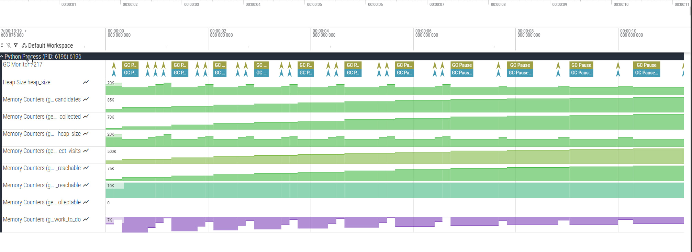

# Output formats

gcmon writes traces in four formats, selected with `--format`: `chrome` (Chrome
Trace Event), `perfetto` (Perfetto binary protobuf), `jsonl` (JSONL to file),
and `stdout` (JSONL to stdout). See the [CLI reference](cli.md) for the flag
itself.

## Chrome trace and Perfetto output



*A gcmon capture in the Perfetto UI.*

What Perfetto gets that Chrome does not:
- **Counter Y-axis sharing**: one metric shares an axis across generations, so
  `G0 collected`, `G1 collected` and `G2 collected` line up.
- **`Processes` track**: a minimap of the session, one slice per monitored
  process, so these join to pids one-to-one. Filter on the track name
  `Processes` in SQL. A slice spans what gcmon *observed*, so a process that
  never collected still gets a full-width one, and `gcmon combine` draws
  narrower GC-activity-only spans since no monitor stands behind it. **Read the
  lifetime from `real_start_ts` and `real_end_ts`, not from the width.** Every
  process shares the track and slices on a Perfetto track must nest, so two
  overlapping spans leave the earlier one cut short, sometimes to nothing.
  Processes starting close together, the normal case for a fan-out of children,
  cut hardest. The two annotations survive the cut; see
  [Perfetto SQL](perfetto-sql.md).
- **Process ordering**: first event timestamp orders the tracks, so the earliest
  process sits at the top.
- **Process command lines**: with the [`[cmdline]`
  extra](rss.md#the-cmdline-extra); see
  [Process command lines](#process-command-lines).
- **`Start Process` marker**: a zero-duration instant on each process track, at
  that process's first event. Perfetto hides a track carrying no events, and
  this keeps the track and its label rendering. Perfetto-only, so filter it out
  when enumerating slices.
- **RSS counter track**: one `rss` counter per PID under `--rss`, in bytes,
  sampled at `--rss-interval` (default 1s).
- **`GC Loss` track**: one row per interpreter, `GC Loss {iid}`, under that
  process's own track; see [GC Loss slices](#gc-loss-slices).

> **Note:** sub-step slices (Mark Alive, Fill increment, Deduce Unreachable, …)
> need a CPython build carrying the extra GC instrumentation. A standard build
> gives the top-level `GC Pause` slices and the counters.

### GC Loss slices

A target whose collector runs faster than gcmon polls loses records; see
[How gcmon reads a process](monitoring.md). Each interval gcmon went blind in
gets one slice on a `GC Loss {iid}` track of its own.

**One span per poll interval**, from one read of the target to the next, so
consecutive spans meet without overlapping and the row reads as a sequence.
Every GC run a span accounts for finished between those two reads, and nothing
places it closer.

**Read the magnitude from the args, not the width.** One lost 5 ms run can draw
a 130 ms bar. That is why these slices get a row of their own, where nobody
mistakes an interval-width bar for a very long `GC Pause`.

The name lists the generations that lost records, `GC Loss(0,2)`, so the row
says which went blind before you click anything, and each combination keeps its
own colour.

Each slice carries these totals for the whole interval:

| Arg | Meaning |
|---|---|
| `iid` | Interpreter the records were lost from |
| `observed_count` | Records gcmon read in this interval, across every generation |
| `missing_count` | Records it missed in the same interval |
| `seen` | The share that survived, as `87.0% (47 of 54)`. One interval wide, unlike the `--stats` table's `Cov` |
| `missing_pause_total` | Pause time the runs behind those records took, as `3s 316ms 458µs 100ns`. The bar above it can be 29 s wide |
| `missing_pause_total_ns` | The same total in nanoseconds, from the target's own counter. Sum this one in SQL |

Then one group per generation that collected or lost anything, named `gen0`,
`gen1`, `gen2`:

| Arg | Meaning |
|---|---|
| `observed_count` | Records of that generation gcmon read in this interval |
| `missing_count` | Records of it gcmon missed |
| `missing_collections` | Which ones, on that generation's `collections` counter: `413..431` for a range, `11` for a single one, both ends included |
| `missing_pause_total` / `_ns` | What those cost, as text and as nanoseconds |

A generation that came through whole still gets a group with what it observed,
so the groups add up to the totals above them. In SQL the trace processor
flattens a group by joining the names with a dot, so `gen1`'s count is
`args.debug.gen1.missing_count`. A JSONL capture carries the same numbers under
`lost_*` names; see [Loss records](#loss-records).

**The counts are exact.** gcmon takes them by subtracting two of the target's
cumulative counters, so a group reading `missing_count = 19` also reads
`413..431`. Between the first and last record gcmon read on a generation's
counter, every run is either drawn as a `GC Pause` slice or inside exactly one
span's range. None twice, none missing.

At default settings the track reads as a near-solid bar, since gcmon is blind
for most of every tick. Lower `--rate` or a calmer workload thins it out. See
[Statistics](statistics.md) for what the loss does to the numbers.

### Process command lines

gcmon follows child PIDs, and `Process 4821` tells you nothing about which one
it is. So gcmon records each command line in **three** places, no one of which
serves both the UI and SQL:

| Where | Form | Visible in the UI | Queryable from SQL |
|---|---|---|---|
| `ProcessDescriptor.cmdline` on the process track | argv, one string per argument | Yes | **No** — the trace processor does not surface this field |
| `description` on the process track | argv joined with single spaces | Yes | Yes, via `args` (key `description`) |
| `cmdline` debug annotation on the `Process {pid}` slice of the `Processes` track | argv joined with single spaces | Yes, in the slice's details | Yes, via `args` (key `debug.cmdline`) |

Queries for the latter two are in
[Trace Analysis with Perfetto SQL](perfetto-sql.md#example-querying-process-command-lines).

Recording them needs the [`[cmdline]` extra](rss.md#the-cmdline-extra) and fails
quietly: a missing `psutil`, or a process already gone, drops the command line
and leaves the trace valid. A `combine` run reads historical PIDs, so that is
its normal case.

Command lines are **Perfetto-only**. The Chrome Trace format carries a
`process_name` metadata event per PID and no command line.

## JSONL output

With `--format jsonl` (writes to file) or `--format stdout` (writes to
terminal), each line is a JSON object holding one GC record:

```jsonl
{"pid": 12345, "tid": 0, "gen": 0, "iid": 1, "ts_start": 1700000000000000, "ts_stop": 1700000001500000, "heap_size": 1048576, "collections": 42, "collected": 120, "uncollectable": 0, "candidates": 300, "duration": 0.0015}
{"pid": 12345, "tid": 0, "gen": 1, "iid": 2, "ts_start": 1700000200000000, "ts_stop": 1700000235000000, "heap_size": 2097152, "collections": 3, "collected": 85, "uncollectable": 1, "candidates": 150, "duration": 0.035}
```

| Field | Description | Build |
|-------|-------------|-------|
| `pid` | Process ID of the monitored target | Standard |
| `gen` | GC generation (0, 1, or 2) | Standard |
| `iid` | Interpreter ID (`0` for the main interpreter) | Standard |
| `ts_start`, `ts_stop` | When the run started and stopped (nanoseconds) | Standard |
| `heap_size` | Number of live objects the run recorded | Standard |
| `collections` | How many times this generation has run, cumulative | Standard |
| `collected` | Objects this run collected | Standard |
| `uncollectable` | Objects that could not be collected | Standard |
| `candidates` | Candidate objects for collection | Standard |
| `duration` | Pause duration in seconds (float, as reported by CPython) | Standard |
| `increment_size` | Increment size for incremental GC | Custom build |
| `alive_size` | Objects marked alive (gen > 0) | Custom build |
| `finalized_garbage_count` | Objects this run finalized | Custom build |
| `deleted_garbage_count` | Objects this run deleted | Custom build |
| `clear_weakrefs_count` | Weakrefs this run cleared | Custom build |

> **Note:** Fields marked **Custom build** require a CPython build with enhanced
> GC instrumentation — see the
> [Chrome trace and Perfetto output](#chrome-trace-and-perfetto-output) note
> above.

### Loss records

A session that missed records writes one line per blind poll interval per
interpreter, alongside the GC records. A loss record carries no `collections`
and no `gen` of its own; the per-generation counts sit in `gens`:

```jsonl
{"pid": 12345, "tid": -2, "iid": 0, "ts_start": 1700000001500000, "ts_stop": 1700000098000000, "gens": [{"gen": 0, "observed_count": 11, "lost_from": 413, "lost_count": 9, "lost_pause_ns": 57450000}, {"gen": 1, "observed_count": 3, "lost_from": 27, "lost_count": 1, "lost_pause_ns": 8100000}]}
```

| Field | Description |
|-------|-------------|
| `tid` | `-2 - iid`, the sentinel the trace formats draw the `GC Loss` track on. `-1` is reserved for `rss` |
| `iid` | Interpreter the records were lost from |
| `ts_start`, `ts_stop` | The interval, from one poll to the next (nanoseconds). Its width is uncertainty, not pause time |
| `gens` | One entry per generation that ran or lost anything in the interval |

and in each `gens` entry:

| Field | Description |
|-------|-------------|
| `gen` | The generation |
| `observed_count` | Records of it gcmon read in this interval |
| `lost_from` | First record gcmon missed, on that generation's `collections` counter |
| `lost_count` | Records of it gcmon missed. Zero for a generation that lost nothing |
| `lost_pause_ns` | Pause time the runs behind those records took, in nanoseconds |

An entry and the `gen{N}` group on the slice drawn from it hold the same numbers
under different names:

| `gens` entry | `gen{N}` group |
|---|---|
| `gen` | the group's own name, `gen0`, `gen1`, `gen2` |
| `observed_count` | `observed_count` |
| `lost_count` | `missing_count` |
| `lost_from` with `lost_count` | `missing_collections`, both ends included |
| `lost_pause_ns` | `missing_pause_total_ns`, with `missing_pause_total` beside it as text |

The far end, `lost_from + lost_count - 1`, is stored nowhere. Keeping both ends
would let them disagree, and `lost_count` is the number `--stats` sums.

Line order carries no meaning: converting to a trace sorts on `ts_start` first.
A loss record can be the earliest line in a capture, since its interval opens at
the poll before the records that closed it.

Tell the record types apart by field presence: a GC record has `collections`, a
loss record has `gens`, an instant event has `type`. `gcmon combine` reads loss
records back and redraws the spans, and `--normalize` shifts them with
everything else.

A capture written before the record went per-poll is **not** readable: no older
shape carries `gens`, so `gcmon combine` stops with a decoding error rather than
reading a blind interval as an observed run. Re-capture, or convert with the
gcmon that wrote it.
